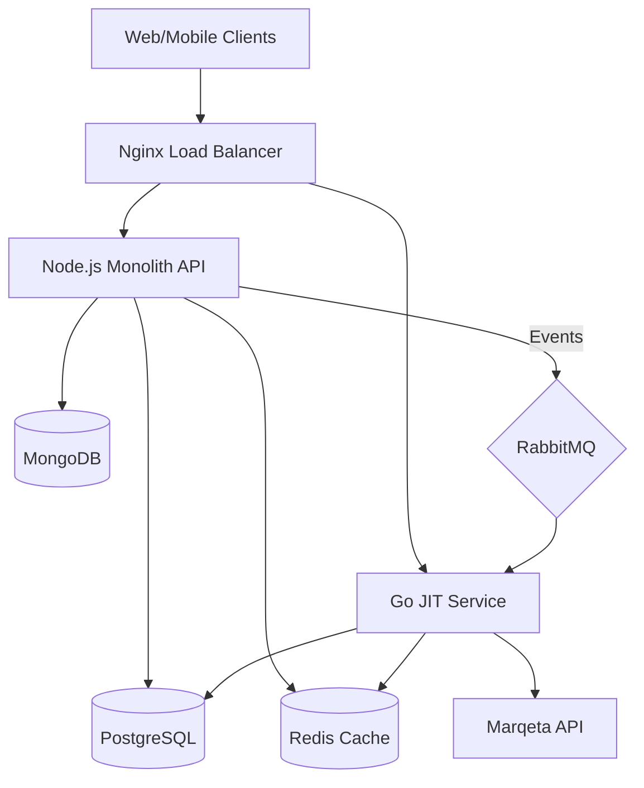
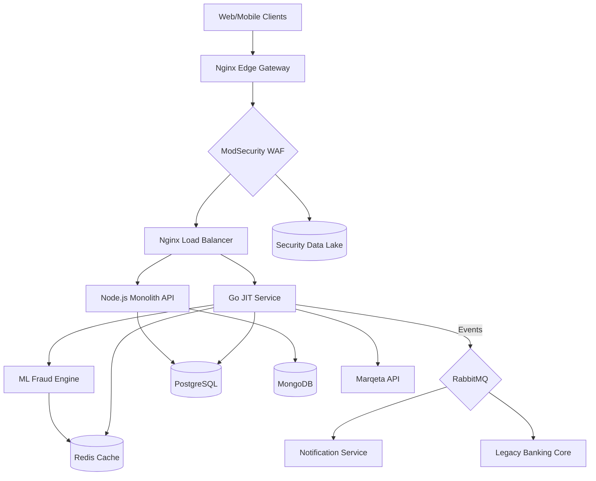

# 🏦 Atlanticfrewaycard Platform (V2)

**Unified card platform combining business expense management and personal virtual cards.**
*Enterprise-ready with Event-Driven Architecture and Microservices.*


## 🎯 Platform Overview

Atlanticfrewaycard has evolved into a robust, scalable platform leveraging modern infrastructure:
- **Business Module**: Corporate expense management (SpendCtrl)
- **Personal Module**: Individual virtual cards with crypto funding (Freeway Cards)
- **JIT Funding Engine**: Real-time authorization processing (Go Microservice)

## 🏗️ Architecture Evolution

### Phase 1: Hybrid Monolith (Current Foundation)



### Phase 2: The Fortress 🐰 (Production-Ready Upgrade)



**The Fortress Architecture** represents three "legs":
- 🐰 **Head**: Deep Security (Ingress Shield with WAF, mTLS, threat detection)
- 🐰 **Body**: Intelligent Decisioning (ML Fraud Engine, Real-time scoring)
- 🐰 **Legs**: Operational Scalability (Distributed data layer, event-driven async)

See [ARCHITECTURE_FORTRESS_BLUEPRINT.md](./ARCHITECTURE_FORTRESS_BLUEPRINT.md) for detailed implementation guide.

### Components
1. **Core API (Node.js)**: Handles business logic, user management, and dashboards.
2. **JIT Funding Service (Go)**: High-performance microservice for processing card authorizations in <100ms.
3. **Message Broker (RabbitMQ)**: Decouples transaction processing from user-facing APIs.
4. **Security**: PCI-compliant encryption (AES-256) and tiered caching.
5. **ML Fraud Engine**: Real-time transaction scoring with behavioral biometrics and velocity checks.

## 🚀 Quick Start

### Prerequisites
- Docker & Docker Compose
- Node.js 20+ (for local dev)
- Go 1.21+ (for service dev)

### 🐳 Docker Deployment (Recommended)
The entire platform (App, Go Service, DBs) can be launched with a single command:

```bash
# 1. Clone repository
git clone <repository-url>

# 2. Setup Env
cp .env.required .env
# (Edit .env with your keys)

# 3. Launch
docker-compose up -d --build
```

Access the services:
- **Web App**: `http://localhost:80`
- **Business Dashboard**: `http://localhost:80/business`
- **JIT Service Health**: `http://localhost:8080/health`

### 🔧 Local Development

**Frontend:**
```bash
cd frontend
npm install
npm run dev
```

**JIT Service (Go):**
```bash
cd jit-funding-service
go run main.go
```

## 🔧 Development Status

### ✅ Phase 1-5 (V1) Completed
- Foundation, Core Services, Security, Compliance, and Basic Frontend.

### ✅ Roadmap V2 Completed
- [x] **Event-Driven Architecture**: RabbitMQ implementation for decoupled transactions.
- [x] **JIT Funding Microservice**: High-concurrency Go service for zero-latency authorizations.
- [x] **Advanced Monitoring**: Sentry, Prometheus, and ELK integration.
- [x] **Infrastructure**: Docker Compose & Kubernetes manifests (`k8s/`).
- [x] **Dashboards**: Next.js Business and Personal dashboards.
- [x] **Fortress Architecture**: Security-first design with ML fraud detection.

## 📁 Key Directories

- `src/`: Backend Node.js source code
- `frontend/`: Next.js Web Application
- `jit-funding-service/`: Go Microservice code
- `k8s/`: Kubernetes deployment manifests
- `docker-compose.yml`: Container orchestration
- `ARCHITECTURE_FORTRESS_BLUEPRINT.md`: Detailed fortress architecture guide
- `BUSINESS_ROI_ANALYSIS.md`: Financial projections and milestones
- `SCALING_STRATEGY.md`: Technical and operational scaling roadmap

## 🤝 Contributing

1. Fork the repository
2. Create feature branch (`git checkout -b feature/amazing-feature`)
3. Commit changes (`git commit -m 'Add amazing feature'`)
4. Push to branch (`git push origin feature/amazing-feature`)
5. Open a Pull Request

## 📄 License

MIT License
